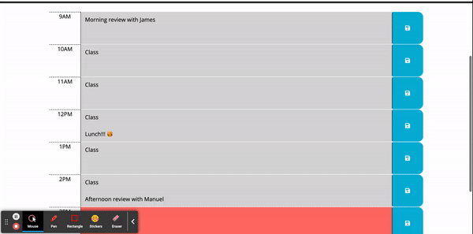

# Work Day Scheduler

5th challenge of the UCB Extension Bootcamp

[Link to the deployed page](https://liubovsobolevskaya.github.io/Work-Day-Scheduler/)
_______________________________________

If you use a daily planner to create a schedule, the planner will display the current day at the top of the calendar when you open it. As you scroll down, you will see timeblocks for standard business hours. Each timeblock for the current day will be color coded to show whether it is in the past, present, or future. If you click on a timeblock, you can enter an event and save it by clicking the save button. The planner will store the event in your computer's memory, so even if you refresh the page, the saved events will still be there.
__________________________

## Code Example

This code snippet sets up a click event listener on the button within the container element. When a user clicks on the button, it retrieves the ID of the parent hour div and the text entered by the user in the textarea element, and then it saves them to the local storage using the localStorage.setItem() method. Essentially, this code allows the user to save the text entered in the textarea element for a particular hour block to the local storage by clicking on the save button.

```javascript
// Set up a click event handler on the root element that listens for clicks on save buttons
rootEl.on('click', '.saveBtn', function (event) {
    // Get the ID of the parent hour div and the text entered by the user, and save it to local storage
    var theHour = $(this).parent().attr("id");
    var textToSave = $(`#${theHour}`).children().eq(1).val();
    localStorage.setItem(theHour, textToSave);
})
```
____________________________________

## Technology Used 

* [HTML](https://developer.mozilla.org/en-US/docs/Web/HTML)
* [CSS](https://developer.mozilla.org/en-US/docs/Web/CSS)      
* [Git](https://git-scm.com/)     
* [JavaScript](https://www.javascript.com/)
* [JQuery](https://jquery.com/)

## Mock-Up

Here is the web application's appearance.:



## Author Info

### Liubov Sobolevkaya
* [LinkedIn](https://www.linkedin.com/in/liubov-sobolevskaya-45756a101)
* [Github](https://github.com/LiubovSobolevskaya)
* [Kaggle](https://www.kaggle.com/lyubovsobolevskaya)
